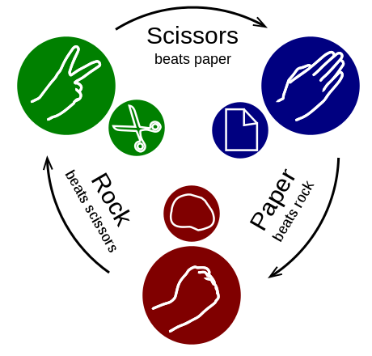

### File

* _None_

### Instructions

* In groups of 4, begin the process of coding out the rock-paper-scissors game.

* Have users play the game 10 times, then show them their total scores.

**Rules for rock-paper-scissors**

* Rock: wins against scissors, loses to paper, and ties against itself.
* Paper: wins against rock, loses to scissors, and ties against itself.
* Scissors: wins against paper, loses to rock, and ties against itself.

* Do as much as you can on your own, but don't be afraid to ask for help if you feel your team is struggling.

* **NOTE:** Don't worry. We know this is a very challenging assignment. We also know that you won't know where to start. In fact, we haven't shown you EVERYTHING you need yet, but that's okay. Part of being a developer is figuring things out on your own through trial and error.
